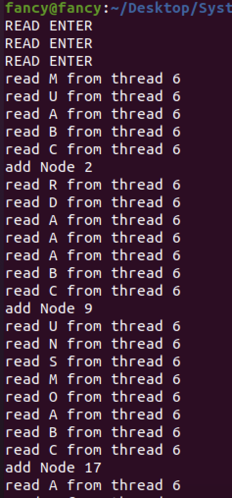
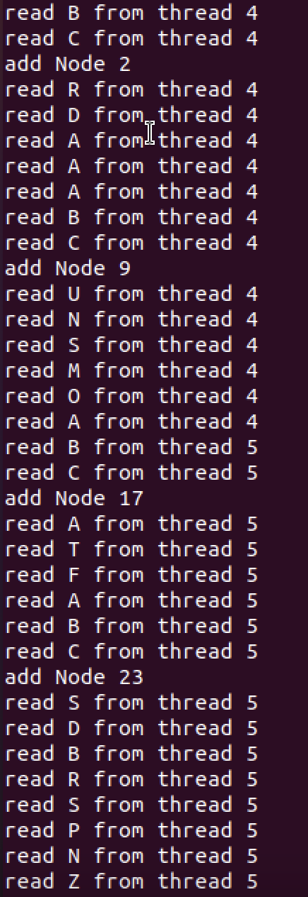

# KU_FS

## 🗓️기간
2022.11.

## ⚙️기술
- C

## 📖소개
쓰레드를 사용한 병렬처리 프로그램입니다.

## ✅기능
1. 부분 문자열 탐색
2. 탐색 결과를 연결리스트에 저장
2. 중복 제거 후 인덱스를 오름차순으로 출력

## 👥역할
- 개인 프로젝트

## 🚀실행
소스 코드를 linux 환경에서 실행합니다.

보고서 분실했습니다.

파일 읽기를 모든 쓰레드가 경쟁적으로 수행합니다. 쓰레드들은 공유 전역변수를 사용합니다.

병렬화의 의미가 거의 없는 비효율적인 방식이지만, 쓰레드와 뮤텍스의 사용과 이해에 도움이 되었습니다.

첫번째와 다른 방식으로 critical section을 늘리고자 했고 프로그램의 효율보다 학습에 중점을 두었습니다.

과제 점수는 낮게 받았습니다.
